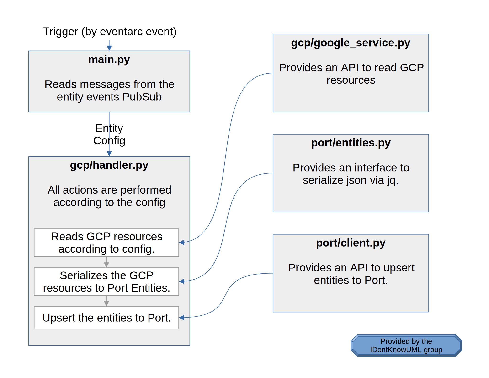

# Paz's GCP to Port Exporter
###### a.k.a. clouds are pretty cool, y'know?

This is a module to export data from your google cloud into Port™ organization.

Deployment should be rather simple, and includes just a few steps described later in this readme.

## How It Works

The module includes two main resources:

The `CloudFunction` export function - Responsible for reading the cloud data, converting it to entities, and exporting to port. Triggerred by the following pubsub.

The `PubSub` entity events - The messages pushed here should match the config.json schema; This defines what resources the export function reads and how it serializes them to entities.


Aditional resources include:

The `SchedulerJob` scheduler job - Periodically pushes a message to the entity events. Causes a scheduled export based on a config.json set on deployment.

The `Secret` port login - A secret with the the port logging parameters. The required values could be found on the bottom left of [port website](https://www.getport.io), under `Help` > `Credentials`.


The export function's source architecture (its this library! yay!) is described in the following chart


## How To Deploy

### What you'll need
First, you'll need a [Google Account](https://www.gmail.com) (duh), and subscribe to the [Google Cloud Provider](https://console.cloud.google.com/) (also duh).

You'll also need this project locally, and have Terraform available.

The google cloud cli `gcloud` is also recommanded to be installed.


### Set A Function Source Repo

First, you need to make sure that you have a source repo with this project on your GCP project.

This can be done in the [GCP Repos Console](https://source.cloud.google.com/repo/connect).

You could either mirror the code from the github (`https://github.com/pazhersh/port-exercise.git`), or clone locally and upload it there.

### Enable The Required Cloud Services

This could be done via the GCP web ui, but is recommanded to enable via the following `gcloud` command:
```bash
gcloud services enable \
    cloudbuild.googleapis.com \
    cloudscheduler.googleapis.com \
    secretmanager.googleapis.com \
    pubsub.googleapis.com \
    cloudfunctions.googleapis.com \
    run.googleapis.com \
    eventarc.googleapis.com \
    artifactregistry.googleapis.com \
    compute.googleapis.com
```

### Terraform Deploy

Terraforming deployment is pretty straight forward.
In the project's directory:

* init terraform:
```bash
terraform init
```

* apply terraform:
##### note that the `-auto-aprove` is not mandatory
```bash
terraform apply -auto-aprove
```

### Enjoy life

You're done deploying!
